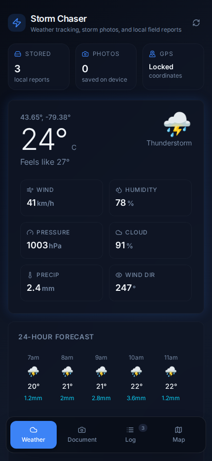
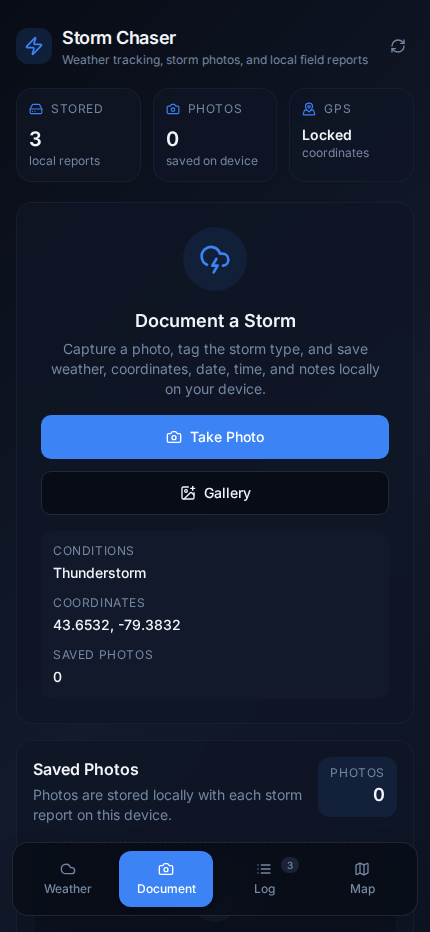
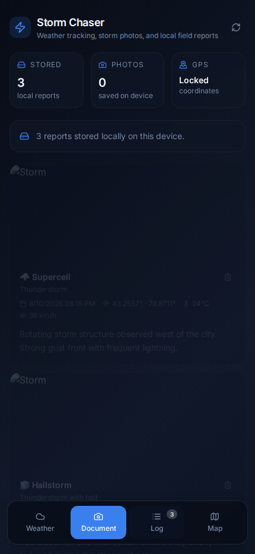
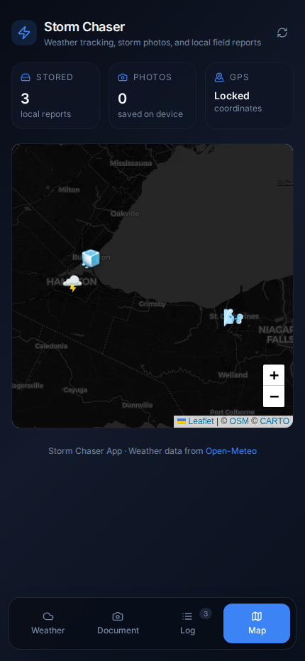

# Storm Chaser

**A mobile-first weather and storm field-documentation application built with React, TypeScript, and Capacitor.**

Storm Chaser brings live weather conditions, location-aware storm documentation, local report storage, photo capture, and map-based review into one field-friendly workflow. It is designed around a simple problem: when severe weather is moving quickly, a user should be able to check conditions, document what they are seeing, and preserve the report without jumping between unrelated apps.

The project combines a responsive React interface with device geolocation, Open-Meteo weather data, Capacitor camera support, local-first persistence, and Leaflet mapping.

## Screenshots

<p align="center">
  
  &nbsp;&nbsp;
  
</p>

<p align="center">
  <strong>Weather</strong> — current storm conditions, field metrics, forecasts, GPS status, and locally stored report counts.<br/>
  <strong>Document</strong> — mobile-first storm capture workflow with camera/photo-library support and field metadata.
</p>

<p align="center">
  
  &nbsp;&nbsp;
  
</p>

<p align="center">
  <strong>Storm Log</strong> — locally persisted observations with storm type, weather, location, time, and notes.<br/>
  <strong>Map</strong> — saved storm reports plotted geographically with storm-specific markers.
</p>

> README screenshots were captured from the real production build in a mobile browser viewport using deterministic demo weather and report data.

## Product at a glance

| Area | Implementation |
| --- | --- |
| Frontend | React + TypeScript + Vite |
| Mobile layer | Capacitor with Android project included |
| Weather | Open-Meteo forecast API |
| Location | Capacitor Geolocation on native builds, browser Geolocation fallback |
| Photo capture | Capacitor Camera on native builds, browser camera/file fallback |
| Persistence | IndexedDB with localStorage fallback |
| Mapping | Leaflet with CARTO / OpenStreetMap tiles |
| UI | Tailwind CSS, shadcn/ui, Framer Motion, Lucide |
| Testing | Vitest + Playwright tooling |

## Field workflow

```text
Device Location
      ↓
Current Weather + Forecast
      ↓
Capture / Select Storm Photo
      ↓
Attach Time + GPS + Weather + Storm Type + Notes
      ↓
Compress Image + Save Report Locally
      ↓
Review in Gallery / Storm Log / Map
```

The core workflow is intentionally local-first. Storm reports do not require an application backend to be useful, and saved observations remain available across sessions on the device or browser where they were recorded.

## Core features

### Live weather and forecasts

- Uses the device's current coordinates to request current conditions from Open-Meteo
- Displays temperature, apparent temperature, humidity, precipitation, pressure, cloud cover, wind speed, and wind direction
- Includes hourly and seven-day forecast views
- Maps WMO weather codes to readable descriptions and visual conditions
- Includes loading skeletons, refresh controls, and a dedicated failure state when weather cannot be retrieved

### Storm documentation

- Capture a new image from the device camera or select an existing image
- Native Capacitor camera support with browser-compatible fallbacks
- Compress image data before persistence to make local storage more practical on mobile devices
- Associate each observation with:
  - storm classification
  - timestamp
  - coordinates
  - current weather conditions
  - temperature and wind data when available
  - field notes
- Supports thunderstorms, tornadoes, hurricanes, hailstorms, blizzards, derechos, microbursts, supercells, and custom/other events

### Local-first persistence

Storm reports are stored through a small persistence layer rather than directly inside UI components.

The application attempts to use **IndexedDB** first and falls back to **localStorage** when IndexedDB is unavailable or fails. Reports are sorted by observation time when loaded and persist across browser or app sessions on the same device.

### Storm log and gallery

Saved observations can be reviewed as a structured storm log, while captured images are surfaced through the photo gallery. Report counts and saved-photo counts are also visible from the main dashboard so the user can quickly confirm what has been stored locally.

### Map-based review

Saved reports with coordinates are rendered on a Leaflet map. Each observation uses a storm-specific marker and can expose its storm type, date, and notes through the map interface.

When multiple observations exist, the map automatically fits the report locations rather than forcing the user to manually find each event.

## Architecture

```text
React UI
  │
  ├── useGeolocation
  │     ├── Capacitor Geolocation (native)
  │     └── Browser Geolocation (web)
  │
  ├── useWeather
  │     └── Open-Meteo API
  │
  └── useStormReports
        └── storm-report-storage
              ├── IndexedDB
              └── localStorage fallback

Saved Reports
  ├── Photo Gallery
  ├── Storm Log
  └── Leaflet Map
```

The project keeps device access, API requests, persistence, and presentation concerns separated. Weather fetching lives in its own hook, geolocation is abstracted behind native/web behavior, and report storage is isolated from page components.

## Mobile implementation

Storm Chaser includes a Capacitor Android project under [`android/`](android/). The same React application can therefore run as a mobile web experience during development and as a native-container Android build with access to Capacitor plugins.

The native path uses Capacitor for camera and geolocation access. Browser fallbacks remain available so the UI and core workflow can also be tested without requiring an emulator or physical phone for every change.

## Reliability and fallback behavior

Field software has to remain useful when a dependency is unavailable, so several failure paths are handled explicitly:

- Weather API failure produces a dedicated retry state instead of a broken dashboard
- Browser geolocation failure falls back to a default location so weather functionality can continue
- IndexedDB failure falls back to localStorage
- Native camera access has browser-compatible photo-selection paths
- Loading states prevent the interface from presenting incomplete weather data as final results

## Testing

The repository includes Vitest coverage for weather utility behavior, including WMO descriptions and icon selection, along with Playwright browser tooling for UI-level validation.

Run the existing checks with:

```bash
npm test
npm run build
npm run lint
```

## Run locally

### Requirements

- Node.js 20+ recommended
- npm

### Install and start

```bash
git clone https://github.com/Kyla-Zeit/storm-chaser-app.git
cd storm-chaser-app
npm install
npm run dev
```

Vite will print the local development URL in the terminal.

### Production build

```bash
npm run build
npm run preview
```

## Android development

After building the web assets, sync the Capacitor project and open Android Studio:

```bash
npm run build
npx cap sync android
npx cap open android
```

Camera and location behavior depends on the permissions granted by the device or emulator.

## Project structure

```text
src/
  components/
    AppNav.tsx
    CurrentWeather.tsx
    DailyForecast.tsx
    HourlyForecast.tsx
    PhotoGallery.tsx
    StormDocForm.tsx
    StormLog.tsx
    StormMap.tsx
    WeatherNotFound.tsx
    WeatherSkeleton.tsx

  hooks/
    use-geolocation.ts
    use-storm-reports.ts
    use-weather.ts

  lib/
    storm-report-storage.ts

  pages/
    Index.tsx
    NotFound.tsx

  test/
    example.test.ts
    weather.test.ts

  types/
    storm.ts

android/
docs/assets/
Documentation/
```

## Tech stack

**Frontend:** React · TypeScript · Vite · Tailwind CSS · shadcn/ui  
**Mobile:** Capacitor · Capacitor Camera · Capacitor Geolocation · Android  
**Data & APIs:** Open-Meteo · IndexedDB · localStorage  
**Mapping:** Leaflet · OpenStreetMap / CARTO tiles  
**UI:** Framer Motion · Lucide React  
**Quality:** Vitest · Playwright · ESLint

## Documentation

A fuller project write-up is included in [`Documentation/Maguire_Rebecca_Storm_Chaser_App.pdf`](Documentation/Maguire_Rebecca_Storm_Chaser_App.pdf).

## Current scope

Storm Chaser is a portfolio project demonstrating mobile-first product design, browser/native capability bridging, third-party API integration, device-aware workflows, local persistence, mapping, and practical fallback behavior.

The current implementation stores field reports locally rather than synchronizing them to a shared cloud account. A production multi-user version would need authenticated cloud storage, cross-device synchronization, stronger offline conflict handling, and a defined data-retention/security model for uploaded media.
